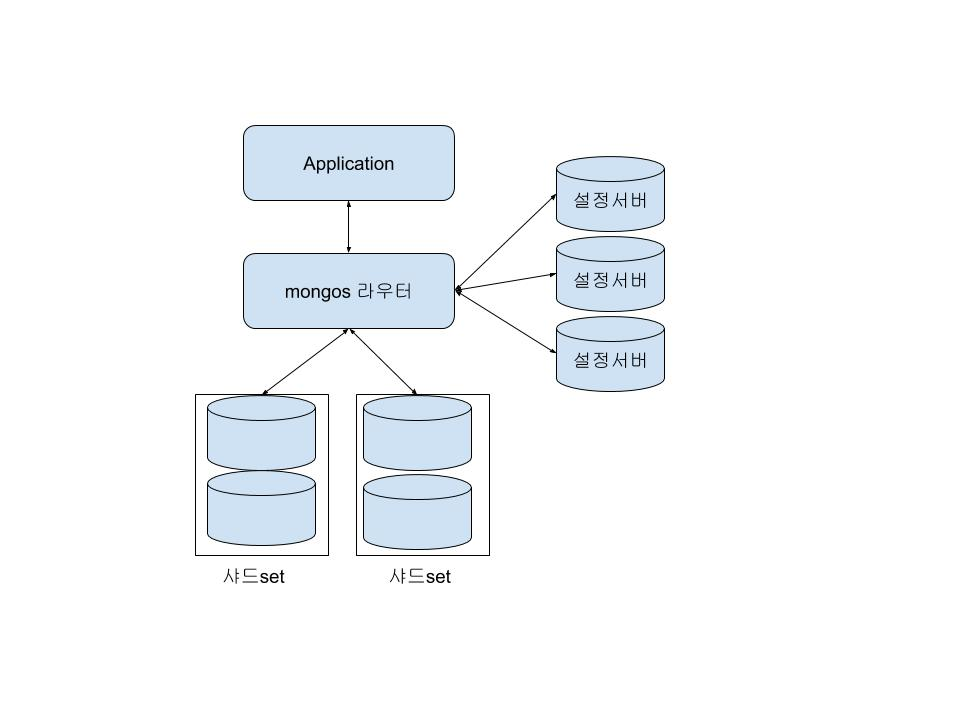

### 클러스터, 샤딩
#### 샤딩
 - 데이터베이스를 작은 조각으로 분할하여 단일 머신이 모든 데이터를 저장하거나 전체 로드를 처리하지 않도록하기위해 고안된것. DB의 수평분할.
 - 저명한 구현체
 아파치 HBase: 자동 샤딩을 제공한다.  
 Azure SQL Database Elastic Database tools  
 카우치베이스 서버: 자동 투명 샤딩, 최고 성능 제공.  
 CUBRID: 버전 9.0부터 샤딩 지원  
 일래스틱서치  
 eXtreme Scale  
 하이버네이트 샤드  
 IBM 인포믹스  
 Kdb+: 버전 2.0부터 샤딩 지원  
 MonetDB  
 몽고DB: 버전 1.6부터 샤딩 지원  
 MySQL 클러스터  
 MySQL 패브릭 (MySQL 유틸리티의 일부)  
 오라클 데이터베이스 샤딩  
 오라클 NoSQL 데이터베이스  
 OrientDB: 버전 1.7부터 샤딩 지원  
 Solr 엔터프라이즈 서치 서버  
 스패너  
 SQLAlchemy ORM  
 The DWH of Teradata  

#### 목적
 - 저장소 분산과 부하 분산

#### 언제?
 - 저장소의 용량이 모자를때 생각해볼 수 있음.
 - CPU, 램, I/O 등의 리소스들에 의한 부하가 심할때 생각해볼 수 있음.
 - 결국 하나의 서버에 제한된 리소스들을 전부 소모했음에도 불구하고 리소스가 부족할때!
 - 네트워크 사용, 디스크 사용, 작업 데이터대 사용 가능한 램의 비율을 분석후 그 결과에 바탕을 두어야함.

#### 샤드 클러스터

##### 샤드set
 - 애플리케이션 데이터를 저장한다.
 - 단일 mongod 서버이거나 애플리케이션 데이터의 파티션을 저장하는 복제세트.
 - 해당 샤드에 직접 연산을 실행하려면 클러스터의 전체 데이터 중 일부만 표시됨.
 - 즉, 데이터가 나누어져서 들어가있음.

##### mongos 라우터
 - 쿼리를 라우팅하고 결과를 수집한다. mongos는 샤드로 어플리케이션 데이터를 쓰거나 샤드로부터 어플리케이션 데이터를 읽는다.
 - 클라이언트에게 클러스터와의 단일 접촉지점을 제공한다.
 - 지속성이 없는 경량 프로세스이다. 즉, 메모리에 설정 서버 메타제이터의 로컬 복사본을 캐시한다.

##### 설정서버
 - 클러스터에 대한 메타데이터를 영구적으로 저장하며 어떤 샤드가 어떤 데이터 하위 집합을 가지는지 등의 정보들이 들어있다.
 - mongos는 지속성이 없으므로 메타데이터를 따로 가지고 있는 서버가 필요하다. 글로벌 클러스터의 설정사항과 각 DB, 컬렉션, 각 범위의 데이터의 위치 그리고 샤드간 데이터 전송내역을 가지고 있는 log
 - 동작이나 설정파일들은 다 얘가 들고있으므로 mongos는 얘한테 설정정보를 가지고 시작한다.
 - 하나의 설정서버만 둔 채로 운영을 하는짓은 하지말자.

##### Application
 - 단일 mongos로 쿼리를 보낸다.

#### 샤드된 클러스터에서의 데이터 분산
##### 샤드된 데이터베이스 구성요소
 - 데이터베이스
   - 시스템의 최상위 레벨 그룹으로 컬렉션을 포함한다.
   - 데이터베이스 이름과 컬렉션 이름의 조합은 시스템 전체에서 고유해야한다 -> 네임스페이스

 - 컬렉션
    - 데이터베이스 내에 명명된 그룹화된 도큐먼트

 - 청크
   - 필드의 값별로 클러스토된 도큐먼트 그룹
   - 샤드 설정에만 존재하는 개념으로, 샤드 Key를 기반으로하는 도큐먼트의 논리적 그룹
   - ex>
   ~~~
    username이 'bakkum'과 'verch' 사이에 있는 모든 도큐먼트
   ~~~

 - 도큐먼트
    - mongodb에서 가장 작은 데이터 단위.

##### 분산방법
 - 컬렉션의 파티션 or 청크 수준에서 컬렉션의 도큐먼트 자체가 분할되어 도큐먼트의 샤드키라는 필드 또는 집합의 값에 따라 여러 샤드에 분산된다.
 - 데이터베이스 단위 분산
    - 말그대로 데이터베이스 자체를 분리된 샤드에 할당.
 - 컬렉션 내에서 샤딩
    - 자동샤딩 영역
    - 청크를 기반으로 각 컬렉션에 데이터를 나누어서 각 샤드에 배치한다.
    - **샤드키** !!!! 중요!

#### 샤딩 클러스터 질의
 - 샤드 키가 쿼리에 포함되어 있으면 mongos는 신속하게 어느 샤드에 결과값이 들어있는지 결정할수있음 -> target query
 - 그 반대의 경우 대대적인 샤드방문 -> global query, scatter/gather query

#### 샤딩 클러스터 인덱싱
 - 각 샤드는 자신만의 인덱스를 가진다. 샤드 컬렉션에 인덱스를 선언하면 각 샤드는 별도의 인덱싱을 생성한다.
 - 각 샤드에 대한 샤드 컬렉션은 같은 인덱스가 있어야한다. 같은 쿼리인데 성능차이 발생가능성 있음.
 - 샤드 컬렉션은 id 필드와 샤드 키에 대해서만 unique 인덱스를 허용한다.

#### explain()
 - 맨 마지막 파이프라인에 위치하며 몇개의 샤드에 질의를 던졌는지 등의 정보들이 나온다.

#### 샤드키
 - 샤드키를 선정하는것은 중요하다.
 - 핫스팟 : 일부 샤드키는 모든 읽기 또는 쓰기가 단일 샤드에 있는 단일 청크로 향하는 상황을 만든다. -> 너무 범용적인 데이터를 샤드키로 선정했을 때
 - 분할할 수 없는 청크 : 너무 조잡한 샤드키는 동일한 샤드 키를 가진 도큐먼트를 다수 발생시킬 수 있다. -> 해석이 이상한것같은데 설명 읽어보면, 데이터의 덩어리가 너무 큰 경우임.
 - 낮은 수준의 타기팅 : 사드키가 쿼리와 관계가 없으면 쿼리 성능이 저하된다. -> 샤드키가 완전히 무작위인 경우
 - 복합 샤드키를 사용하면 좋다.

#### 프로비저닝
 - Mongodb에 자원과 머신을 할당하는 방법
 - 복제 세트의 각 멤버들은 별도의 서버에 있어야한다.
 - 모든 복제 세트 멤버들은 자신만의 서버가 필요하다.
 - 복제 세트 아비터는 한 대의 서버를 다른 프로세스와 공유해도 될만큼 경량이다.
 - 설정 서버는 한대의 서버를 공유할 수 있다.

#### 장애상황
 - 샤드 멤버 장애 : 각 샤드는 복제 세트로 구성되어 있으므로, 한쪽이 장애가 나면 세컨더리 멤버가 프라이머리가 되며, mongos 프로게스슨 자동으로 그 프라이머리에 연결된다.
 - 설정 서버 장애 : 설정서버가 3개 미만이 될 경우 읽기만 허용되로 모든 분할과 밸런싱은 일시정지된다. 읽기와 쓰기는 여전히 수행되고 밸런서는 세 개의 설정 서버가 복구되고 나면 중단되었던 시점부터 다시 시작한다.
 - mongos 장애 :  mongos는 Application에서 실행하기때문에 Application 서버에 장애가 일어난 것일 가능성이 높다. mongos 프로세스는 상태를 갖지 않으므로 프로세스 재시작정도로 끝남.

#### 기타 ~
 - 자동적인 밸런싱을 위한 프로세스는 과부하된 샤드에서 데이터를 이동시켜야하기 때문에 샤딩 자체는 시스템의 부하를 가중시킨다.
