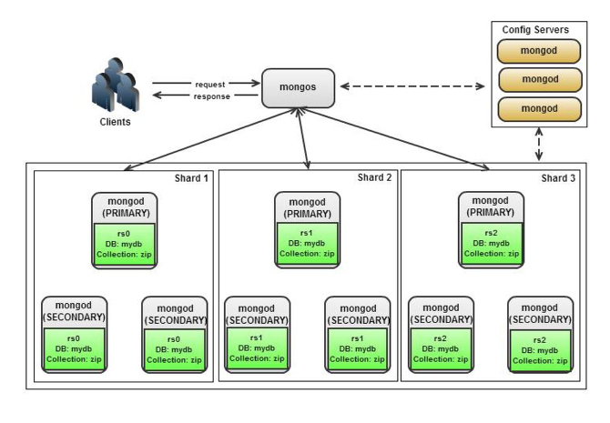

## 클러스터, 샤딩
### 샤딩
 - 데이터베이스를 작은 조각으로 분할하여 단일 머신이 모든 데이터를 저장하거나 전체 로드를 처리하지 않도록하기위해 고안된것. DB의 수평분할.
 - 샤딩의 목적은 저장소 분산과 부하분산
 - 데이터 용량이 커지면 단일 서버로는 리소스에 대한 한계가 있을 수 있기 때문에 몽고DB는 Scale Out을 위해 샤딩을 지원한다.
 - 저명한 구현체  
 아파치 HBase: 자동 샤딩을 제공한다.  
 Azure SQL Database Elastic Database tools  
 카우치베이스 서버: 자동 투명 샤딩, 최고 성능 제공.  
 CUBRID: 버전 9.0부터 샤딩 지원  
 일래스틱서치  
 하이버네이트 샤드  
 IBM 인포믹스  
 Kdb+: 버전 2.0부터 샤딩 지원  
 MonetDB  
 몽고DB: 버전 1.6부터 샤딩 지원  
 MySQL 클러스터  
 MySQL 패브릭 (MySQL 유틸리티의 일부)  
 오라클 데이터베이스 샤딩  
 오라클 NoSQL 데이터베이스  
 OrientDB: 버전 1.7부터 샤딩 지원  
 Solr 엔터프라이즈 서치 서버  
 ... 등등

### Sharded Cluster
샤드 클러스터의 구성은 다음과 같다

|엘라스틱 서치|몽고DB|
|---|---|
|노드|샤드|
|마스터노드,Ingest Node|mongos|
|마스터노드, 레플리카 샤드|Config Servers|
|샤드|청크 - 최대 청크 크기 64MB|

##### 샤드

 - 애플리케이션 데이터를 저장한다.
 - 단일 mongod 서버이거나 애플리케이션 데이터의 파티션을 저장하는 복제세트.
 - 해당 샤드에 직접 연산을 실행하려면 클러스터의 전체 데이터 중 일부만 표시됨.
 - 즉, 데이터가 나누어져서 들어가있음.

##### mongos 라우터
 - 쿼리를 라우팅하고 결과를 수집한다. mongos는 샤드로 어플리케이션 데이터를 쓰거나 샤드로부터 어플리케이션 데이터를 읽는다.
 - 클라이언트에게 클러스터와의 단일 접촉지점을 제공한다.
 - 지속성이 없는 경량 프로세스이다. 즉, 메모리에 설정 서버 메타제이터의 로컬 복사본을 캐시한다.

##### 설정서버
 - 클러스터에 대한 메타데이터를 영구적으로 저장하며 어떤 샤드가 어떤 데이터 하위 집합을 가지는지 등의 정보들이 들어있다.
 - mongos는 지속성이 없으므로 메타데이터를 따로 가지고 있는 서버가 필요하다. 글로벌 클러스터의 설정사항과 각 DB, 컬렉션, 각 범위의 데이터의 위치 그리고 샤드간 데이터 전송내역을 가지고 있는 log 등을 가지고 있다.
 - 실제 배포 서비스에서는 3개의 configserver을 구성해야한다.(deprecated sccc)
   - 3.2부터 복제세트로 배포 할 수 있다.(CSRS)
 - `RBAC`라는 각 샤드들에 대한 접근제한 설정도 갖고있다.
 - 주의 할 것은 각 클러스터마다 각각의 config server 를 사용 해야한다, 서로다른 클러스터가 같은 config server를 사용하면 안된다.

##### Application
 - 단일 mongos로 쿼리를 보낸다.

#### 분산방법
- 데이터 베이스 수준에서 데이터베이스가 모든 컬렉션과 함께 샤드에 위치
  - 어플리케이션이 직접 수동으로 분할해야한다.
  - 해당 방식은 권하지 않는다.
- 컬렉션 내에서 샤딩
   - 어플리케이션이 아니라 Mongodb 자체가 auto sharding
   - 청크를 기반으로 각 컬렉션에 데이터를 나누어서 각 샤드에 배치한다.
   - **샤드키** !!!! 중요!

#### 샤딩 클러스터 질의
- 샤드 키가 쿼리에 포함되어 있으면 mongos는 신속하게 어느 샤드에 결과값이 들어있는지 결정할수있음 -> target query
- 그 반대의 경우 대대적인 샤드방문 -> global query, scatter/gather query

#### 샤딩 클러스터 인덱싱
- 각 샤드는 자신만의 인덱스를 가진다. 샤드 컬렉션에 인덱스를 선언하면 각 샤드는 별도의 인덱싱을 생성한다.
- 각 샤드에 대한 샤드 컬렉션은 같은 인덱스가 있어야한다. 같은 쿼리인데 성능차이 발생가능성 있음.
- 샤드 컬렉션은 id 필드와 샤드 키에 대해서만 unique 인덱스를 허용한다.

#### explain()
- 맨 마지막 파이프라인에 위치하며 몇개의 샤드에 질의를 던졌는지 등의 정보들이 나온다.

#### 샤드키
- 샤드키를 선정하는것은 중요하다.
- 샤드 키는 하나의 컬렉션에 데이타 청크들을 어떻게 샤딩해서 나눌 것인가를 정하는 기준을 삼을 수 있는 index 의 일종으로 써, 서로 다른 샤드에서도 데이터 상태를 공유하여 unique를 유지 할 수도 있다. 보통 unique index는 해당 샤드 내에서 이므로 서로 다른 샤드 에서는 겹칠 수도 있다.
- > **중요!** 컬렉션이 한번 샤딩되면 샤드키는 불변이다. 하지만 4.2부터 id필드를 샤드키로 사용하지 않으면 업데이트할 수 있다.  샤드키의 변경은 데이터 마이그레이션, 청크 마이그레이션을 일으키므로 오래걸리고 민감하며 서비스 중단이 일어날 수 있으므로 조심히 써야한다.

#### 샤드키 선택시 고려사항
 - [Cardinality 분포](https://docs.mongodb.com/manual/core/sharding-shard-key/#shard-key-cardinality) : 각 샤드키 마다 묶여진 데이터셋 크기가 차이가 많이나면 효과가 없다.
 - [같은 샤드키의 빈도](https://docs.mongodb.com/manual/core/sharding-shard-key/#shard-key-frequency) : 샤드키가 같은 document의 갯수가 많아지면 청크 분리도 힘들 수도 있으므로 같거나 비슷한 샤드키를 나타내는 빈도를 줄여야 한다.(병목이 걸릴 수 있다.)
 - [샤드키 변경의 용이성](https://docs.mongodb.com/manual/core/sharding-shard-key/#monotonically-changing-shard-keys) : 샤드키의 복잡성이 너무 낮아 샤드키의 변경이 쉬우면 안된다. 그렇게되면 샤드키의 단조로움으로 인해 청크가 무더기로 변경되는 경우가 생기기도 하고 쉽게쉽게 청크가 변경되기도 한다..
 - 복합 샤드키를 사용하면 좋다.

### 샤딩 방법들
#### Hashed 샤딩
 - Hashed Index를 이용하는 Hashed샤딩 방법은, mongos가 각 샤드로의 쿼리를 BroadCasting방식으로 할지 TargetedCasting방식으로 할 지 결정하는 로직에 대한 비용을 줄여준다.

 - 해시 인덱스의 ([float를 지원하지 않는](https://docs.mongodb.com/manual/core/index-hashed/#considerations))단점으로 인해 청크 분리에 대한 생각을 해야한다.

#### Ranged 샤딩
 - Hashed 샤딩이나 zone을 만들지 않으면 기본적으로 Range-based 샤딩이다.
먼저 나온 고려사항과 같은 높은 카디널리티와, 적은 빈도수, 단조롭지 않은 샤드키 변경용이성 등을 고려해야 효과적이 샤딩이 가능하다.

#### [zone](https://docs.mongodb.com/manual/core/zone-sharding/)
 - Range-Base샤딩의 경우, 청크 분배를 위한 zone을 만들 수 있다.
해당 zone을 만들 경우 청크 splite시에도 zone내부에서만 청크 분리 및 머지가 일어난다.

### 유지보수
-   지속적인 모니터링
    -   serverStatus , currentOp()
-   샤드 추가
-   샤드 삭제
-   컬랙션을 샤드 안으로 부터 삭제하는 방법은 공식적으로 지원하지 않기 때문에 다른 컬랙션에 백업을 하고 삭제한다.
-   샤드 클러스터 백업
    -   청크 마이그레이션 비활성화
        -   샤드 백업중 마이그레이션이 발생할 수 있으며 데이터 누락현상이 발생한다.
    -   설정 서버 메타데이터
-   기존 컬랙션에도 샤딩을 적용할 수 있지만 마이그레이션에도 많은 시간이 소요되며 디스크 연산도 수반된다.
     -   즉 기존 컬랙션에 하는 것 보다는 미리

#### 장애 조치와 복구
 - 샤드 멤버 장애 : 각 샤드는 복제 세트로 구성되어 있으므로, 한쪽이 장애가 나면 세컨더리 멤버가 프라이머리가 되며, mongos 프로게스슨 자동으로 그 프라이머리에 연결된다.
 - 설정 서버 장애 : 설정서버가 3개 미만이 될 경우 읽기만 허용되로 모든 분할과 밸런싱은 일시정지된다. 읽기와 쓰기는 여전히 수행되고 밸런서는 세 개의 설정 서버가 복구되고 나면 중단되었던 시점부터 다시 시작한다.
 - mongos 장애 :  mongos는 Application에서 실행하기때문에 Application 서버에 장애가 일어난 것일 가능성이 높다. mongos 프로세스는 상태를 갖지 않으므로 프로세스 재시작정도로 끝남.
